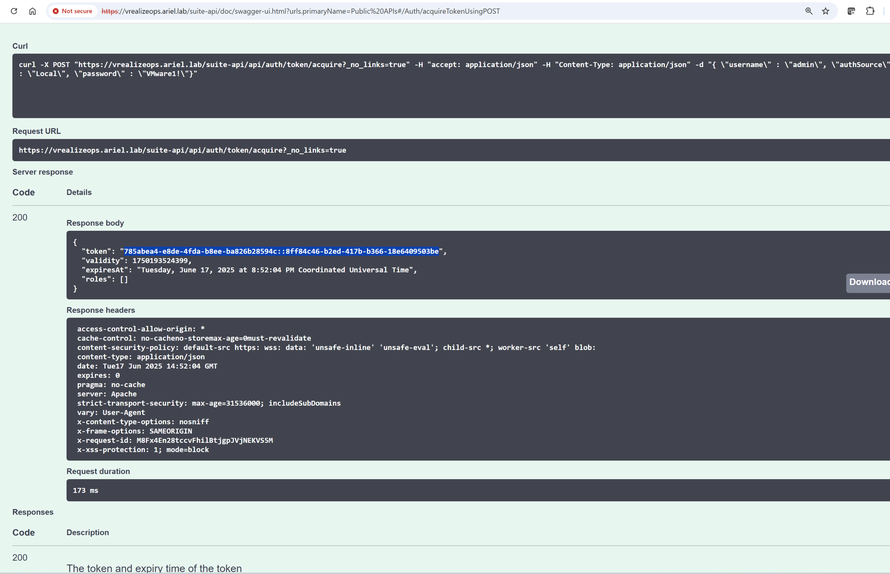

I'm trying to get this code to work

https://www.nicktailor.com/?p=1888

(You will see I've tried to simplify it, removing some lines and options, but it doesn't seem to do any effect).

I'm getting an error that it doesn't see any json in the output.

It seems that for some reason, I'm not being able to access the actual token in the json body, just the headers.

)

When I try on the Swagger API interface the Ops instance brings, I can see the body and the headers. How do I access the token in the body inside the ansible playbook?

